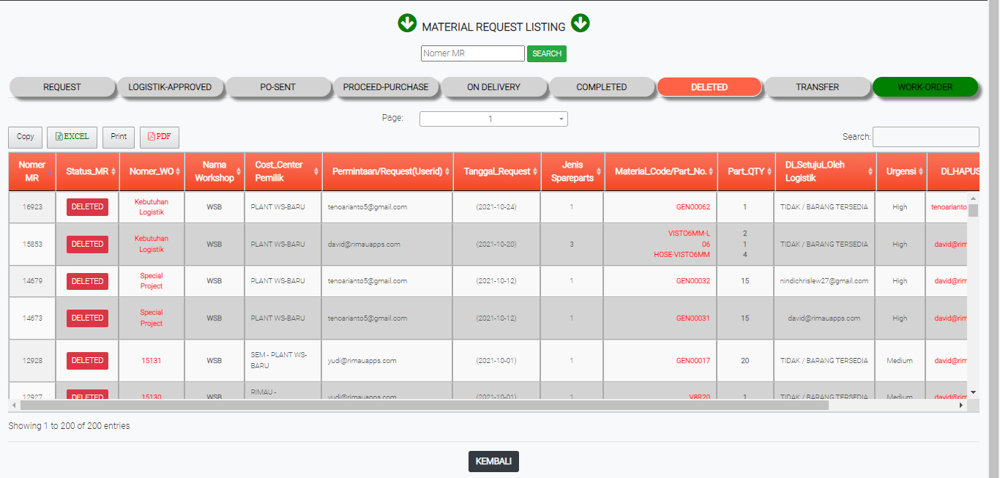

# DELETED

### DELETED

Tabel ini menginformasikan permintaan sparepart atau barang yang tidak jadi dipesan atau dihapus.

### FORM DELETED

Form ini akan keluar jika user meng-klik status di tabel dalated. From ini memberikan data data permintaan barang yang tidak jadi dipesan atau dibatalkan.
