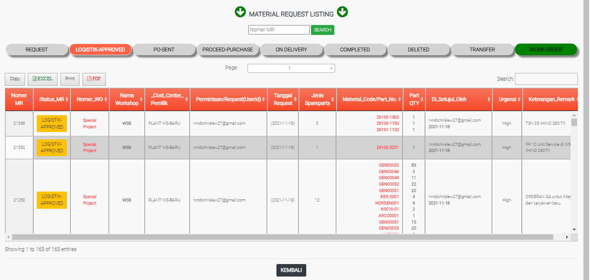

# LOGISTIK-APPROVED

### LOGISTIK-APPROVED

Tabel ini melihat informasi permintaan persetujuan logistik untuk sparepart atau barang yang diminta.

### FORM LOGISTIK-APPROVED

Form ini akan keluar jika user meng-klik status di tabel logistik-approved. From ini memberikan data data permintaan barang dan harus disetujui oleh pihak logistik.
