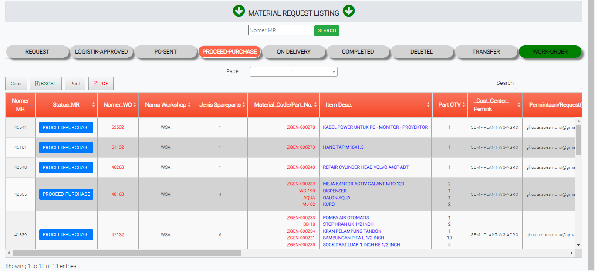

# PROCEED-APPROVED

### PROCEED-APPROVED

Tabel ini menginformasikan sparepart atau barang yang telah dipesan dan akan diterima oleh operator.

### FORM PORCEED-PURCHASE

Form ini akan keluar jika user meng-klik status di tabel proceed-approved. From ini memberikan data data barang atau sparepart yang sudah disetujui dalam pembelian
