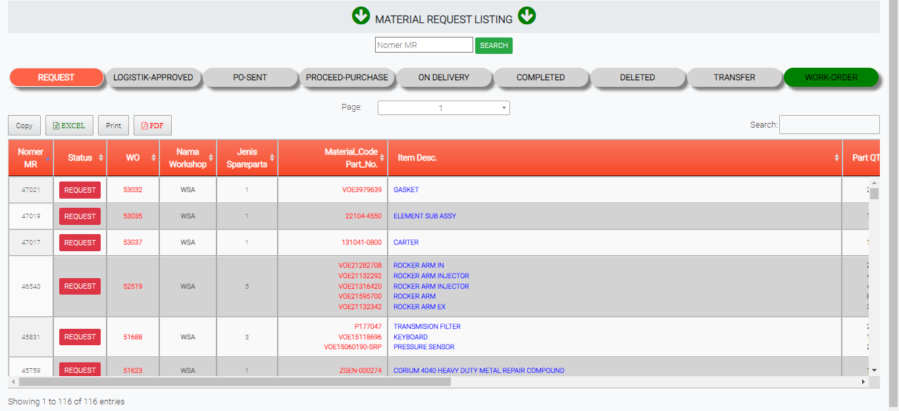

# REQUEST

### REQUEST

Tabel ini menginformasikan permintaan sparepart atau barang untuk kendaraan yang dibutuhkan.

### FORM REQUEST

Form ini akan keluar jika user meng-klik status di tabel request. From ini memberikan data data permintaan barang yang dibutuhkan operator
