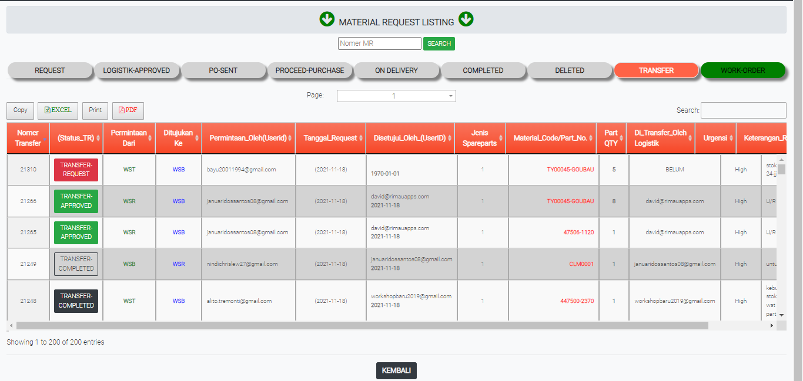

# TRANSFER

### TRANSFER

Tabel ini menginformasikan sparepart atau barang yang ditransfer dari workshop ke workshop lain yang membutuhkan.

### FORM TRANSFER

Form ini akan keluar jika user meng-klik status di tabel transfer. From ini memberikan data data permintaan barang ke workshop lain.&#x20;

Status keadaan yang ditransfer ada&#x20;

* TRANSFER-REQUEST : Permintaan barang yang belum disetujui
* TRANSFER-APPROVED : Permintaan barang yang sudah disetujui oleh pihak workshop&#x20;
* TRANSFER-COMPLETED : Status permintaan barang yang sudah selesai
