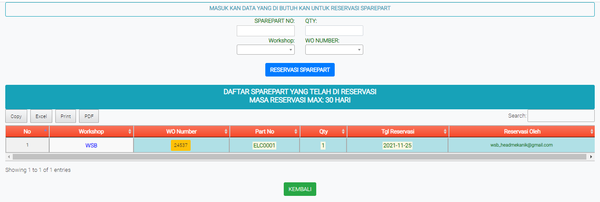

# Module RESERVASI SPAREPART

### MODULE RESERVASI SPAREPART

Module ini digunakan untuk membuat pesanan barang yang operator pesan tidak didahulukan oleh operator lain.

* Sparepart NO : Nomor sparepart
* QYT : Jumlah Sparepart yang dibutuhkan
* Workshop : Nama workshop dimana anda berada (Masukan dengan list yang disediakan)
* WO NUMBER :thumbsup::thumbsup::thumbsup::thumbsup::thumbsup::thumbsup::thumbsup: Masukan WO number kendaraan (ketik atau cari dengan list yang disediakan)
