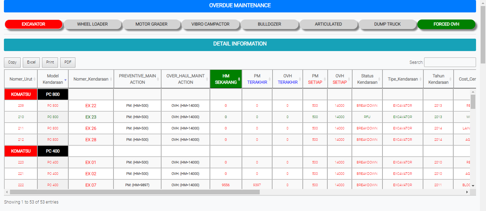

# Module Schedule Maintenance

### OVERDUE MAINTENANCE

Tabel ini untuk menginformasikan kondisi kendaraan alat berat yang digunakan ditambang (EXCAVATOR, WHEEL LOADER, MOTOR GRADER, VIBRO CAMPACTOR, BULLDOZER, ARTICULATED, DUMPTRUCK).

### FORCED OVH

Form ini digunakan memeriksa perbaikan kendaraan alat berat.

* Kendaraan : Cari nama kendaraan di list yang di sediakan&#x20;
* Workshop : Cari nama workshop di list yang di sediakan&#x20;
* Pilih Parts : Masukan sparepart yang cari di list yang disediakan
