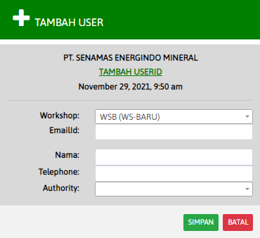

# Module Tambah User (PLANT)

### TAMBAH USER

Form ini untuk menambah user / pengguna baru di workshop.&#x20;

* Workshop: Nama workshop dimana anda berada (Masukan dengan list yang telah di sediakan)
* Email/id: Email / id user baru&#x20;
* Nama: Nama lengkap user baru&#x20;
* Telephone: Nomer telfon user baru&#x20;
* Authority: Jabatan yang diberikan pada user baru (MEKANIK dan PLANT ADMIN)
