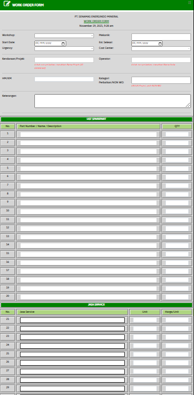

# Module WORK-ORDER

### WORK-ORDER FORM

Form ini membuat permintaan perbaikan kendaraan batubara yang mengalami kerusakan.

* Workshop : Nama workshop di mana pun anda berada (Masukan dengan list yang disediakan)
* Start date : Tanggal masuk kendaraan&#x20;
* Urgency : Prioritas kendaraan (High, Medium, Low)&#x20;
* Kendaraan/Projek : Nomor kendaraan / nomor lambung&#x20;
* HM/KM : HM/KM kendaraan&#x20;
* Mekanik : Nama mekanik yang mengerjakan perbaikan (boleh lebih dari 1)
* &#x20;Est.Selesai : Tanggal estimasi untuk penyelesaian perbaikan&#x20;
* Cost.Center : Nama Cost Center / pemilik kendaraan (Masukan dengan list yang disediakan)
* Operator : Nama operator/driver yang mengoperasikan kendaraan&#x20;
* Kategori perbaikan / NON WO : Kategori perbaikan kendaraan&#x20;
* Keterangan : Informasi perbaikan kendaraan
* &#x20;List Sparepart : Sparepart dan QYT yang dibutuhkan kendaraan.&#x20;
* List sparepart akan keluar secara otomatis.&#x20;
* Jasa Sarvice : Masukan jasa/service, unit, dan harga yang dibutuhkan.
